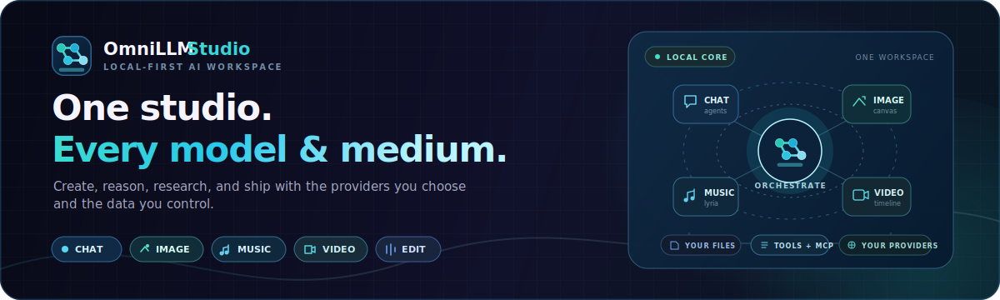
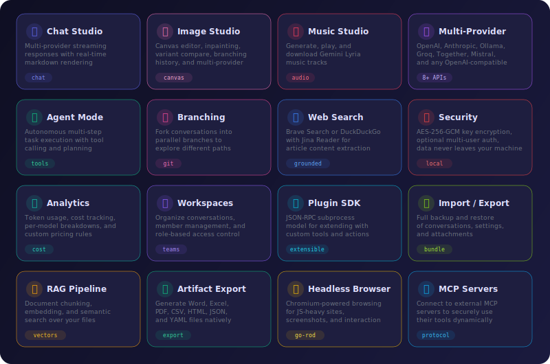
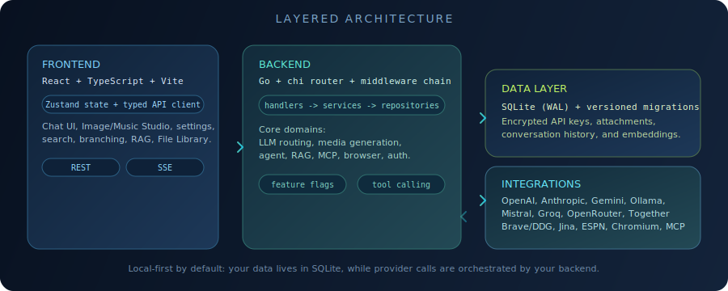
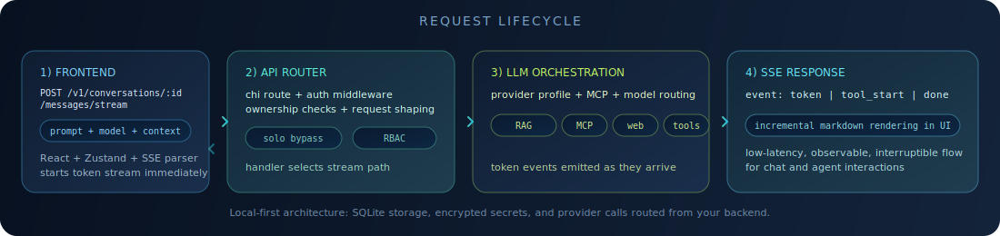

<p align="center">
  
</p>

<p align="center">
  <strong>Local-first LLM chat application</strong> — Go backend + React frontend<br/>
  Multi-provider streaming · Image Studio · RAG · Agent mode · Branching · Web search · Encrypted secrets
</p>

<p align="center">
  
  
  
  
  
  
</p>

---

## Features

<p align="center">
  
</p>

### Core

| Feature | Description |
|---------|-------------|
| **Streaming Chat** | Token-by-token responses via Server-Sent Events with real-time markdown rendering |
| **Multi-Provider** | OpenAI, Anthropic, Ollama, OpenRouter, Groq, Together, Mistral, and any OpenAI-compatible API |
| **Conversation Management** | Create, rename, pin, archive, delete, full-text search, per-conversation model override |
| **Image Studio** | Full canvas editor with generation, editing, inpainting, variant comparison, and branching history |
| **Markdown Rendering** | Syntax highlighting, KaTeX math, Mermaid diagrams, inline image rendering |
| **Auto-Titling** | Conversations are automatically titled based on the first exchange |

### Advanced

| Feature | Description |
|---------|-------------|
| **Agent Mode** | Autonomous multi-step task execution with planning, tool calling, and step approval |
| **RAG Pipeline** | Document chunking, embedding generation, and semantic retrieval over uploaded files |
| **Conversation Branching** | Fork any message into parallel branches — explore different response paths |
| **Semantic Search** | Vector-based search across all conversations with automatic embedding indexing |
| **Web Search** | Brave Search or DuckDuckGo (zero-config) with Jina Reader content extraction |
| **Tool Calling** | Extensible tool framework — web search, calculator, URL fetch, and plugin tools |

### Image Studio

A dedicated image workspace with canvas-based editing, multi-provider generation, and a branching history tree.

| Capability | Description |
|------------|-------------|
| **Text-to-Image** | Generate images from prompts via OpenAI (DALL-E 2/3, GPT-Image), Gemini, Stable Diffusion, Together (FLUX, Imagen), and OpenRouter |
| **Image Editing** | Edit existing images with natural-language instructions and optional mask regions |
| **Canvas & Masking** | Brush / eraser tools with adjustable size, feathered strokes, undo/redo, zoom, and pan — paint masks directly on the canvas for inpainting |
| **Variant Comparison** | Side-by-side or overlay slider view with synchronized zoom/pan to compare generated variants |
| **Branching History** | Tree-view timeline of every generate / edit / variation node — branch from any point and track the active path |
| **Reference Images** | Attach content and style reference images (provider-dependent, up to 14 refs) to guide generation |
| **Advanced Controls** | Aspect ratio / size presets, seed for reproducibility, creativity/guidance scale, and multi-variant (1–10) generation |
| **Prompt Quality Tips** | Real-time prompt analyzer checks for subject specificity, style descriptors, lighting, and composition |
| **Keyboard Shortcuts** | `B` brush, `E` eraser, `V` pan, `M` toggle mask, `[`/`]` brush size, `+`/`-` zoom, `F` fit, `Ctrl+Z` undo, `Ctrl+S` download |

**Supported image providers:**

| Provider | Models | Features |
|----------|--------|----------|
| **OpenAI** | GPT-Image-1.5, GPT-Image-1, DALL-E 3, DALL-E 2 | Generate, Edit, Mask, Content Refs |
| **Gemini** | Gemini 3.1 Flash Image, Gemini 3 Pro Image, Gemini 2.5 Flash Image | Generate, Edit, Mask, Seed, Guidance, Style Refs |
| **Stable Diffusion** | SDXL 1.0, SD v1.6 | Generate, Edit, Mask, Seed, Guidance, Style Refs |
| **Together** | FLUX.1 Pro/Schnell, Imagen 4.0, and 30+ models | Generate, Multi-variant |
| **OpenRouter** | openai/dall-e-3, openai/gpt-image-1 | Generate |

### Platform

| Feature | Description |
|---------|-------------|
| **Workspaces** | Organize conversations into workspaces with rename and member management |
| **Usage & Cost Analytics** | Token usage, cost estimates, per-provider / per-model breakdowns with custom pricing rules |
| **Prompt Templates** | Reusable prompt presets with variable interpolation and categories |
| **Import / Export** | Full backup and restore of conversations, messages, attachments, and settings |
| **Plugin SDK** | JSON-RPC subprocess model for extending functionality with custom plugins |
| **Evaluation Harness** | Run test suites against models and compare scoring results |
| **Multi-User Auth** | Optional — token-based sessions with role-based access (admin / member / viewer) |
| **Encrypted Secrets** | API keys encrypted at rest with AES-256-GCM, never exposed to the frontend |
| **Local-First Storage** | SQLite database with WAL mode, optimized PRAGMAs, survives restarts |

---

## Architecture

<p align="center">
  
</p>

The application follows a clean **layered architecture**:

```
Frontend (React/TS)  ──SSE/REST──▶  Backend (Go/Chi)  ──SQL──▶  SQLite (WAL)
                                          │
                                          ├──▶  LLM Providers (OpenAI-compatible)
                                          ├──▶  Brave Search / DuckDuckGo
                                          └──▶  Jina Reader
```

- **Frontend** — Single-page React app with Zustand state management, Tailwind v4 styling, and Framer Motion animations. Includes a full-featured Image Studio with canvas editor.
- **Backend** — Go HTTP server with Chi router, layered into handlers → services → repositories → database. Image generation routed through provider-specific adapters (OpenAI, Gemini, Stable Diffusion, Together).
- **Database** — SQLite with WAL mode, 21 versioned migrations, 21+ indexes, and performance-tuned PRAGMAs. Image sessions, nodes, assets, masks, and references stored relationally.

## Request Lifecycle

<p align="center">
  
</p>

From a single chat prompt to streamed tokens back in the UI:

1. Frontend sends the prompt to `/v1/conversations/:conversationId/messages/stream`
2. Backend validates auth/ownership, loads context, and routes to the selected provider
3. Optional enrichments run (RAG retrieval, tools, web search) based on settings and model behavior
4. SSE events stream tokens and metadata back to the client in real time

---

## Quick Start

### Prerequisites

| Dependency | Version | Notes |
|-----------|---------|-------|
| **Go** | 1.24+ | Backend |
| **Node.js** | 18+ | Frontend |
| **GCC** | Any | Required for SQLite via cgo — on Windows use [TDM-GCC](https://jmeubank.github.io/tdm-gcc/) or [MSYS2](https://www.msys2.org/) |

### 1. Start the Backend

```bash
cd backend
go run ./cmd/server
```

The API server starts on **http://localhost:8080**.

### 2. Start the Frontend

```bash
cd frontend
npm install
npm run dev
```

Visit **http://localhost:5173**. The Vite dev server proxies `/v1/*` to the Go backend.

### Windows Helper Scripts

```bash
scripts\start-dev.bat        # Both backend and frontend
scripts\start-backend.bat    # Backend only
scripts\start-frontend.bat   # Frontend only
```

### Desktop App (Wails)

OmniLLM-Studio can also run as a **native desktop application** using [Wails v2](https://wails.io/). The Go backend and React frontend are bundled into a single binary with an OS-native WebView window — no browser required.

```bash
# Install Wails CLI (one-time)
go install github.com/wailsapp/wails/v2/cmd/wails@latest

# Build for your current platform
scripts/build-windows.bat    # Windows → build/bin/OmniLLM-Studio.exe
scripts/build-linux.sh       # Linux   → build/bin/OmniLLM-Studio
scripts/build-macos.sh       # macOS   → build/bin/OmniLLM-Studio.app
scripts/build-all.sh         # Detect current OS and build
```

See the [Desktop App](#desktop-app) section below for full details.

### 3. Configure a Provider

Open **Settings** (gear icon) → **Providers** tab → **Add Provider** → enter your API key.

### 4. Enable Web Search (optional)

Open **Settings** → enter a **Brave Search API key** → toggle web search on.
Get a free key at [brave.com/search/api](https://brave.com/search/api/).
Or leave it unconfigured to use DuckDuckGo as a zero-config fallback.

---

## Project Structure

```
OmniLLM-Studio/
├── backend/
│   ├── cmd/
│   │   ├── server/main.go              # Headless HTTP server entry point
│   │   └── desktop/main.go             # Wails desktop app entry point
│   └── internal/
│       ├── api/                         # HTTP handlers + Chi router
│       │   ├── router.go               # Composition root — all wiring happens here
│       │   ├── conversation_handler.go  # CRUD + search + archive
│       │   ├── message_handler.go       # Send, stream (SSE), edit, delete
│       │   ├── agent_handler.go         # Agent runs, steps, approval
│       │   ├── branch_handler.go        # Conversation branching
│       │   ├── search_handler.go        # Semantic search + reindex
│       │   ├── image_handler.go          # Quick image generation
│       │   ├── image_session_handler.go  # Image Studio sessions, editing, masks
│       │   └── ...                      # Additional handlers
│       ├── agent/                       # Planner + Runner (autonomous tasks)
│       ├── analytics/                   # Usage aggregation + cost estimation
│       ├── auth/                        # Token-based auth middleware
│       ├── bundle/                      # Import/export (conversations, attachments)
│       ├── config/                      # Environment variable config
│       ├── crypto/                      # AES-256-GCM encryption
│       ├── db/                          # SQLite init, 21 versioned migrations
│       ├── eval/                        # Evaluation harness (scorer, runner)
│       ├── llm/                         # Provider routing, streaming, embeddings, image generation
│       ├── models/                      # Data models (Go structs + JSON tags)
│       ├── plugins/                     # JSON-RPC plugin loader + runtime
│       ├── rag/                         # Chunker, retriever, context builder
│       ├── repository/                  # Database CRUD layer
│       ├── search/                      # Semantic search service
│       ├── templates/                   # Prompt template seeding
│       ├── tools/                       # Tool registry + executor
│       └── websearch/                   # Brave/DDG + Jina Reader orchestrator
├── frontend/
│   └── src/
│       ├── api.ts                       # Typed API client + SSE stream parser
│       ├── types.ts                     # TypeScript interfaces (mirrors Go models)
│       ├── stores/                      # Zustand state
│       └── components/                  # React components
│           ├── ChatView.tsx             # Chat interface + streaming + usage display
│           ├── Sidebar.tsx              # Conversation list, workspace filter, auth
│           ├── SettingsPanel.tsx         # 6-tab settings (Providers, General, RAG, Tools, Pricing, Auth)
│           ├── SearchPanel.tsx           # Semantic search + reindex
│           ├── AgentRunView.tsx          # Agent run visualization + resume
│           ├── BranchSwitcher.tsx        # Branch management UI
│           ├── WorkspaceSwitcher.tsx     # Workspace switching, rename, members
│           ├── AttachmentPanel.tsx       # Attachment list, download, delete
│           ├── UsageDashboard.tsx        # Analytics dashboard
│           ├── TemplateManager.tsx       # Prompt template CRUD
│           ├── PluginManager.tsx         # Plugin install/manage
│           ├── EvalDashboard.tsx         # Evaluation results
│           ├── ImportExportPanel.tsx     # Backup/restore
│           ├── RAGSourcePanel.tsx        # Document management for RAG
│           ├── LoginScreen.tsx           # Auth login/register
│           └── image/                    # Image Studio components
│               ├── ImageEditStudio.tsx   # Main Image Studio UI + session management
│               ├── ImageCanvas.tsx       # Interactive canvas with drawing + masking
│               ├── CanvasToolbar.tsx     # Brush, eraser, pan, zoom, undo/redo
│               ├── ImageHistoryPanel.tsx # Tree-view branching history
│               ├── VariantComparePanel.tsx # Side-by-side + overlay comparison
│               ├── ImageAdvancedControls.tsx # Size, seed, creativity, variants
│               └── PromptQualityTips.tsx # Real-time prompt quality analyzer
├── scripts/
│   ├── start-dev.bat                    # Dev: backend + frontend
│   ├── start-backend.bat                # Dev: backend only
│   ├── start-frontend.bat               # Dev: frontend only
│   ├── build-windows.bat                # Wails desktop build (Windows)
│   ├── build-linux.sh                   # Wails desktop build (Linux)
│   ├── build-macos.sh                   # Wails desktop build (macOS)
│   └── build-all.sh                     # Wails build orchestrator (CI/CD)
├── build/bin/                           # Desktop build output (git-ignored)
├── docs/                                # Implementation plans & assets
└── LICENSE
```

---

## API Reference

All routes are under `/v1/`.

- In solo mode (no registered users), auth is bypassed.
- In multi-user mode, routes require Bearer auth unless explicitly public.
- Some write/admin operations require role `admin`.

<details>
<summary><strong>Conversations & Messages</strong></summary>

| Method | Path | Description |
|--------|------|-------------|
| `GET` | `/v1/conversations` | List conversations (filter: `?archived=true`, `?workspace_id=`) |
| `POST` | `/v1/conversations` | Create conversation |
| `GET` | `/v1/conversations/:id` | Get conversation |
| `PATCH` | `/v1/conversations/:id` | Update conversation |
| `DELETE` | `/v1/conversations/:id` | Delete conversation |
| `GET` | `/v1/conversations/search?q=` | Search conversations (title + message content) |
| `POST` | `/v1/conversations/:id/title` | Auto-generate title |
| `GET` | `/v1/conversations/:id/messages` | List messages |
| `POST` | `/v1/conversations/:id/messages` | Send message (non-streaming) |
| `POST` | `/v1/conversations/:id/messages/stream` | Send message (SSE streaming) |
| `PATCH` | `/v1/conversations/:id/messages/:mid` | Edit message |
| `DELETE` | `/v1/conversations/:id/messages/:mid` | Delete message + subsequent |

</details>

<details>
<summary><strong>Branching</strong></summary>

| Method | Path | Description |
|--------|------|-------------|
| `GET` | `/v1/conversations/:id/branches` | List branches |
| `POST` | `/v1/conversations/:id/branches` | Create branch (fork from message) |
| `PATCH` | `/v1/conversations/:id/branches/:bid` | Rename branch |
| `DELETE` | `/v1/conversations/:id/branches/:bid` | Delete branch |
| `GET` | `/v1/conversations/:id/messages/branch?branch_id=` | List branch messages |

</details>

<details>
<summary><strong>Attachments & RAG</strong></summary>

| Method | Path | Description |
|--------|------|-------------|
| `GET` | `/v1/conversations/:id/attachments` | List conversation attachments |
| `POST` | `/v1/conversations/:id/attachments` | Upload attachment |
| `GET` | `/v1/attachments/:aid/download` | Download attachment |
| `DELETE` | `/v1/attachments/:aid` | Delete attachment |
| `GET` | `/v1/conversations/:id/chunks` | List document chunks |
| `POST` | `/v1/conversations/:id/reindex` | Re-chunk + re-embed documents |
| `GET` | `/v1/attachments/:aid/chunks` | List chunks for attachment |
| `POST` | `/v1/attachments/:aid/index` | Index attachment (chunk + embed) |

</details>

<details>
<summary><strong>Agent Mode</strong></summary>

| Method | Path | Description |
|--------|------|-------------|
| `POST` | `/v1/conversations/:id/agent/run` | Start agent run |
| `GET` | `/v1/conversations/:id/agent/runs` | List runs for conversation |
| `GET` | `/v1/agent/runs/:rid` | Get run details + steps |
| `POST` | `/v1/agent/runs/:rid/approve/:sid` | Approve pending step |
| `POST` | `/v1/agent/runs/:rid/cancel` | Cancel run |
| `POST` | `/v1/agent/runs/:rid/resume` | Resume failed/cancelled run |

</details>

<details>
<summary><strong>Search</strong></summary>

| Method | Path | Description |
|--------|------|-------------|
| `GET` | `/v1/search?q=&limit=` | Semantic search across conversations |
| `POST` | `/v1/search/reindex` | Rebuild search embeddings |
| `POST` | `/v1/websearch` | Direct web search |

</details>

<details>
<summary><strong>Image Studio</strong></summary>

| Method | Path | Description |
|--------|------|-------------|
| `POST` | `/v1/conversations/:id/messages/image` | Quick image generation (attaches to conversation) |
| `POST` | `/v1/conversations/:id/images/sessions` | Create image editing session |
| `GET` | `/v1/conversations/:id/images/sessions` | List sessions for conversation |
| `GET` | `/v1/conversations/:id/images/sessions/:sid` | Get session with nodes + masks |
| `PATCH` | `/v1/conversations/:id/images/sessions/:sid` | Rename session |
| `DELETE` | `/v1/conversations/:id/images/sessions/:sid` | Delete session (cascade cleanup) |
| `POST` | `/v1/conversations/:id/images/sessions/:sid/generate` | Generate new image(s) in session |
| `POST` | `/v1/conversations/:id/images/sessions/:sid/edit` | Edit image with optional mask |
| `POST` | `/v1/conversations/:id/images/sessions/:sid/mask` | Upload mask image + stroke data |
| `GET` | `/v1/conversations/:id/images/sessions/:sid/assets` | List image assets |
| `DELETE` | `/v1/conversations/:id/images/sessions/:sid/assets/:aid` | Delete variant asset |
| `PUT` | `/v1/conversations/:id/images/sessions/:sid/nodes/:nid/select` | Select variant as active |
| `POST` | `/v1/images/sessions` | Create standalone session |
| `GET` | `/v1/images/sessions` | List all sessions across conversations |

</details>

<details>
<summary><strong>Providers & Settings</strong></summary>

| Method | Path | Description |
|--------|------|-------------|
| `GET` | `/v1/providers` | List provider profiles |
| `POST` | `/v1/providers` | Create provider profile |
| `PATCH` | `/v1/providers/:id` | Update provider profile |
| `DELETE` | `/v1/providers/:id` | Delete provider profile |
| `GET` | `/v1/settings` | Get app settings |
| `PATCH` | `/v1/settings` | Update settings (partial merge) |
| `GET` | `/v1/features` | List feature flags |
| `PATCH` | `/v1/features/:key` | Toggle feature flag |

</details>

<details>
<summary><strong>Analytics & Pricing</strong></summary>

| Method | Path | Description |
|--------|------|-------------|
| `GET` | `/v1/analytics/usage?period=` | Aggregated usage (day/week/month/all) |
| `GET` | `/v1/analytics/conversations/:id/usage` | Per-conversation usage |
| `GET` | `/v1/pricing` | List pricing rules |
| `PUT` | `/v1/pricing` | Upsert pricing rule |
| `DELETE` | `/v1/pricing/:id` | Delete pricing rule |

</details>

<details>
<summary><strong>Templates, Tools & Plugins</strong></summary>

| Method | Path | Description |
|--------|------|-------------|
| `GET` | `/v1/templates` | List prompt templates |
| `POST` | `/v1/templates` | Create template |
| `GET` | `/v1/templates/:id` | Get template |
| `PATCH` | `/v1/templates/:id` | Update template |
| `DELETE` | `/v1/templates/:id` | Delete template |
| `POST` | `/v1/templates/:id/interpolate` | Interpolate template variables |
| `GET` | `/v1/tools` | List available tools |
| `POST` | `/v1/tools/execute` | Execute a tool |
| `PATCH` | `/v1/tools/:name/permission` | Update tool permission |
| `GET` | `/v1/plugins` | List installed plugins |
| `POST` | `/v1/plugins` | Install plugin |
| `PATCH` | `/v1/plugins/:name` | Update plugin |
| `DELETE` | `/v1/plugins/:name` | Uninstall plugin |

</details>

<details>
<summary><strong>Workspaces & Auth</strong></summary>

| Method | Path | Description |
|--------|------|-------------|
| `GET` | `/v1/workspaces` | List workspaces |
| `POST` | `/v1/workspaces` | Create workspace |
| `GET` | `/v1/workspaces/:id` | Get workspace |
| `PATCH` | `/v1/workspaces/:id` | Update workspace |
| `DELETE` | `/v1/workspaces/:id` | Delete workspace |
| `GET` | `/v1/workspaces/:id/stats` | Workspace statistics |
| `GET` | `/v1/workspaces/:id/members` | List members |
| `POST` | `/v1/workspaces/:id/members` | Add member |
| `PATCH` | `/v1/workspaces/:id/members/:uid` | Update member role |
| `DELETE` | `/v1/workspaces/:id/members/:uid` | Remove member |
| `POST` | `/v1/auth/register` | Register user |
| `POST` | `/v1/auth/login` | Login |
| `POST` | `/v1/auth/logout` | Logout |
| `GET` | `/v1/auth/status` | Auth mode status (`auth_enabled`, `has_users`) |
| `GET` | `/v1/users/me` | Current user profile |

</details>

<details>
<summary><strong>Import/Export & Evaluation</strong></summary>

| Method | Path | Description |
|--------|------|-------------|
| `POST` | `/v1/export` | Export data bundle |
| `POST` | `/v1/import` | Import data bundle |
| `POST` | `/v1/import/validate` | Validate import bundle |
| `POST` | `/v1/eval/run` | Run evaluation suite |
| `GET` | `/v1/eval/runs` | List eval runs |
| `GET` | `/v1/eval/runs/:id` | Get eval run results |
| `DELETE` | `/v1/eval/runs/:id` | Delete eval run |

</details>

<details>
<summary><strong>System</strong></summary>

| Method | Path | Description |
|--------|------|-------------|
| `GET` | `/v1/health` | Health check |
| `GET` | `/v1/version` | Backend version string |

</details>

---

## Environment Variables

| Variable | Default | Description |
|----------|---------|-------------|
| `OMNILLM_PORT` | `8080` | Backend server port |
| `OMNILLM_BIND_ADDRESS` | `127.0.0.1` | Bind interface (`127.0.0.1` keeps server local-only) |
| `OMNILLM_DB_PATH` | `omnillm-studio.db` | SQLite database file path |
| `OMNILLM_ATTACHMENTS_DIR` | `attachments` | Directory for file attachments |
| `OMNILLM_CORS_ORIGINS` | `http://localhost:5173,http://localhost:3000` | Comma-separated allowed CORS origins |
| `OMNILLM_ALLOW_PUBLIC_REGISTRATION` | `false` | Allow registration after first user is created |
| `OMNILLM_PLUGIN_DIR` | `~/.omnillm-studio/plugins` | Plugin directory |

---

## Database Performance

The SQLite database is tuned for performance out of the box:

| Setting | Value | Impact |
|---------|-------|--------|
| `journal_mode` | WAL | Concurrent reads during writes |
| `synchronous` | NORMAL | ~10x fewer fsyncs (safe with WAL) |
| `cache_size` | 64 MB | Reduced disk I/O for large queries |
| `mmap_size` | 256 MB | Memory-mapped reads for vector search |
| `temp_store` | MEMORY | In-memory temp tables for sorts |
| `MaxOpenConns` | 4 | Concurrent read connections |
| `PRAGMA optimize` | On shutdown | Updates query planner statistics |

21 versioned migrations, 21+ indexes covering all hot query paths, and periodic session cleanup.

---

## Tech Stack

| Layer | Technologies |
|-------|-------------|
| **Frontend** | React 19, TypeScript 5, Vite, Tailwind CSS v4, Zustand, Framer Motion, Lucide icons, ReactMarkdown, KaTeX, Sonner |
| **Backend** | Go 1.24+, Chi router, SQLite (WAL), SSE streaming, AES-256-GCM |
| **Desktop** | Wails v2, OS-native WebView (WebView2 / WebKitGTK / WebKit) |
| **Search** | Brave Search API, DuckDuckGo (zero-config), Jina Reader |
| **LLM** | OpenAI, Anthropic, Ollama, OpenRouter, Groq, Together, Mistral — any OpenAI-compatible API |
| **Image** | OpenAI (DALL-E/GPT-Image), Gemini, Stable Diffusion, Together (FLUX/Imagen), OpenRouter |

---

## Build

### Server (headless)

```bash
# Development
cd backend && go run ./cmd/server

# Production build with version info
cd backend
go build -ldflags "-X main.version=1.0.0 -X main.commit=$(git rev-parse --short HEAD)" \
  -o omnillm-studio ./cmd/server

# Run tests
cd backend && go test ./...
```

### Desktop App

The desktop build uses [Wails v2](https://wails.io/) to package the Go backend and React frontend into a single native binary with an OS-native WebView window.

#### How It Works

```
┌─────────────────────────────────────┐
│          Native Window              │
│  ┌───────────────────────────────┐  │
│  │     WebView (OS-native)       │  │
│  │  ┌─────────────────────────┐  │  │
│  │  │   React SPA (embedded)  │  │  │
│  │  └────────┬────────────────┘  │  │
│  │           │ fetch /v1/*       │  │
│  └───────────┼───────────────────┘  │
│              ▼                      │
│  ┌───────────────────────────────┐  │
│  │   Go Backend (loopback HTTP)  │  │
│  │   chi router + SQLite         │  │
│  └───────────────────────────────┘  │
└─────────────────────────────────────┘
```

The Go process starts an HTTP server on a random loopback port for SSE streaming support, embeds the frontend via `//go:embed`, and opens a native window. Data is stored in the OS-appropriate user data directory:

| OS | Data Directory |
|----|----------------|
| Windows | `%APPDATA%\OmniLLM-Studio\` |
| Linux | `~/.local/share/OmniLLM-Studio/` (or `$XDG_DATA_HOME`) |
| macOS | `~/Library/Application Support/OmniLLM-Studio/` |

#### Prerequisites

| Dependency | Version | Notes |
|-----------|---------|-------|
| **Go** | 1.24+ | Already required |
| **Node.js** | 18+ | Already required |
| **Wails CLI** | v2.9+ | `go install github.com/wailsapp/wails/v2/cmd/wails@latest` |
| **GCC** | Any | Already required for SQLite via cgo |
| **Windows** | — | WebView2 ships with Windows 10 1803+ |
| **Linux** | — | `sudo apt install libgtk-3-dev libwebkit2gtk-4.0-dev` |
| **macOS** | — | Xcode CLI tools (`xcode-select --install`) |

Verify your environment with `wails doctor`.

#### Build Scripts

| Script | Platform | Output |
|--------|----------|--------|
| `scripts/build-windows.bat` | Windows | `build/bin/OmniLLM-Studio.exe` |
| `scripts/build-linux.sh` | Linux | `build/bin/OmniLLM-Studio` |
| `scripts/build-macos.sh` | macOS | `build/bin/OmniLLM-Studio.app` |
| `scripts/build-all.sh` | Current OS / CI | All platforms |

Each script follows the same flow:

```bash
1. cd frontend && npm ci && npm run build       # Build React SPA
2. Copy frontend/dist → backend/cmd/desktop/frontend_dist/  # Stage for embedding
3. cd backend && go build ./cmd/desktop          # Compile native binary
```

macOS builds support architecture targeting:

```bash
GOARCH=arm64 scripts/build-macos.sh   # Apple Silicon
GOARCH=amd64 scripts/build-macos.sh   # Intel
```

#### CI/CD (GitHub Actions)

For automated cross-platform releases, use platform-native CI runners (CGO cross-compilation is not practical). A sample workflow is documented in [docs/Wails Build Plan.md](docs/Wails%20Build%20Plan.md).

---

## License

MIT — see [LICENSE](LICENSE) for details.
