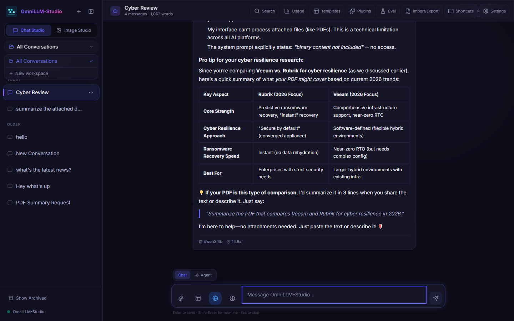
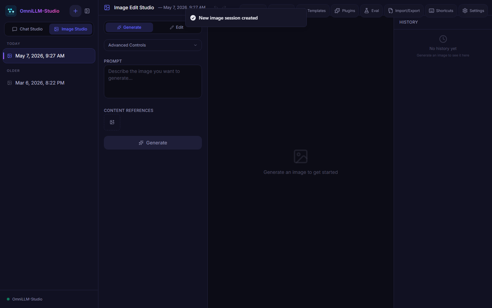
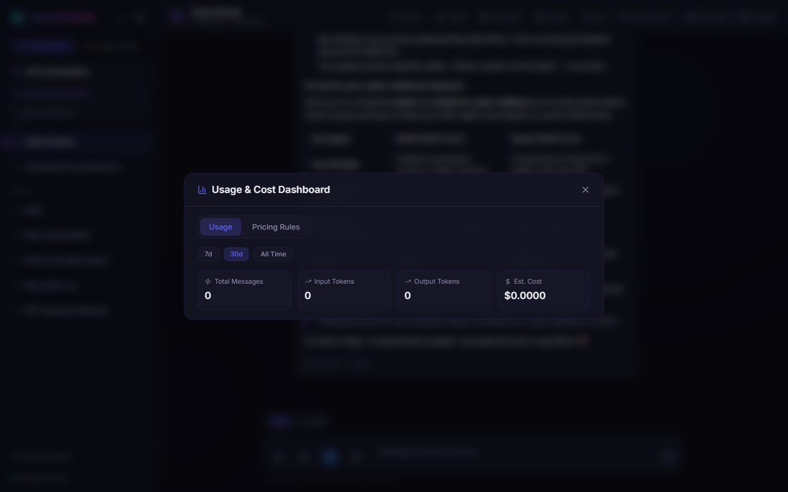
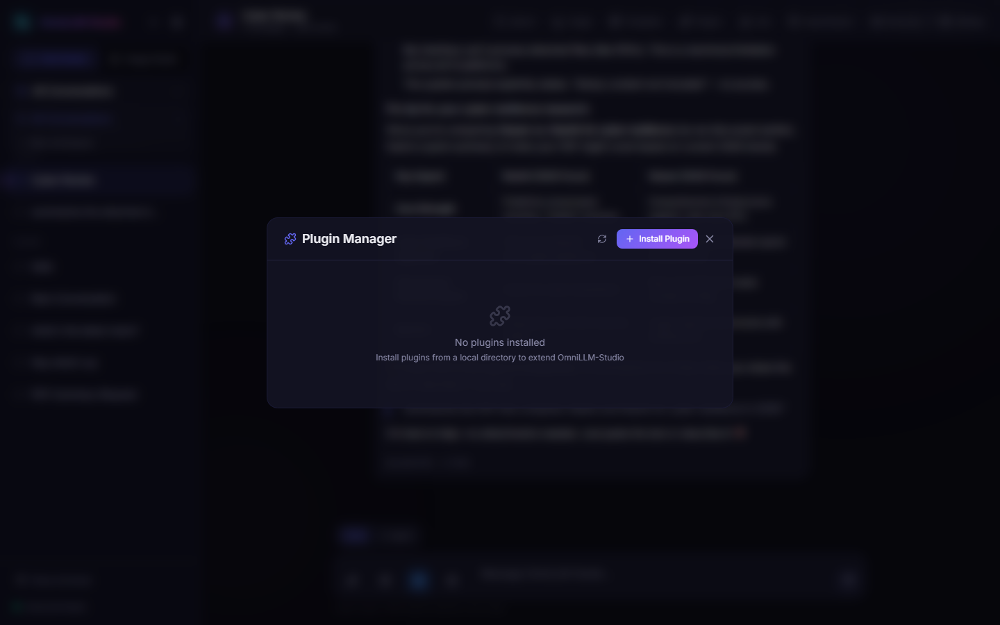

<p align="center">
  
</p>

<h3 align="center">Choose any brain. Work in any medium. Keep one workflow.</h3>

<p align="center">
  OmniLLM-Studio brings chat, agents, image creation, music, video generation, timeline editing, research, and delivery into one local-first workspace.
</p>

<p align="center">
  <a href="#get-running"><strong>Get started</strong></a>
  ·
  <a href="#what-can-you-do"><strong>Explore capabilities</strong></a>
  ·
  <a href="docs/TECHNICAL_REFERENCE.md"><strong>Technical reference</strong></a>
  ·
  <a href="#documentation"><strong>Documentation</strong></a>
</p>

<p align="center">
  
  
  
  
</p>

---

## This is more than a chat app

Most AI tools stop at the answer. OmniLLM-Studio keeps going.

Start with a rough idea. Research it against the web and your own files. Turn it into images, music, or video. Refine it on a canvas or timeline. Compare the models behind it. Export the finished work without rebuilding your context in five different apps.

<p align="center">
  
</p>

## What can you do?

| | Capability | What it unlocks |
|---|---|---|
| **01** | **Talk, reason, and act** | Stream responses from leading models, branch conversations, adjust reasoning depth, and let agents work through multi-step plans with tools and approvals. |
| **02** | **Create and edit images** | Generate across providers, paint masks directly on a canvas, inpaint regions, compare variants, use references, and branch from any visual direction. |
| **03** | **Compose original music** | Shape Gemini Lyria tracks with genre, mood, instruments, BPM, structure, and lyrics—then play, manage, and download them in the same workspace. |
| **04** | **Generate cinematic video** | Move from text, images, audio, or reference video to generated scenes with guided camera, composition, lighting, continuity, and native-audio controls. |
| **05** | **Edit on a real timeline** | Combine video, images, audio, music, captions, shapes, effects, transitions, speed changes, fades, and keyframes—then render with FFmpeg. |
| **06** | **Work from your own knowledge** | Search a durable File Library with hybrid keyword + vector retrieval, bring citations into the conversation, and keep private files ahead of web results. |
| **07** | **Research and automate** | Search the web, read full pages, operate a headless browser, pull live sports data, call MCP servers, and extend the system with plugins. |
| **08** | **Compare, measure, and deliver** | Run model evaluations, track usage and cost, organize workspaces, and export polished Word, Excel, CSV, PDF, Markdown, HTML, JSON, and YAML artifacts. |

## One idea can travel through the whole studio

OmniLLM-Studio is designed around connected work, not isolated generators.

```text
Ask + research  →  Generate an image  →  Build a soundtrack  →  Create a video  →  Edit + export
       ↑                   ↓                     ↓                    ↓
  Your files         Branch + compare      Reuse the asset      Send back to chat
```

- Turn an Image Studio result into the opening frame of a video.
- Carry a Music Studio track directly into the project media bin.
- Ask an agent to research, plan, and prepare the material before generation.
- Register finished assets in the File Library or send them back into a conversation.
- Keep project history, branches, prompts, assets, and outputs together as the work evolves.

## Bring the models you already trust

No single provider is best at everything. OmniLLM-Studio lets each one do what it does best without forcing you into a single ecosystem.

**Chat and reasoning:** OpenAI, Anthropic, Google Gemini, Ollama, OpenRouter, Groq, Together AI, Mistral, and OpenAI-compatible endpoints.

**Images:** OpenAI image models, Gemini and Imagen, Stable Diffusion, FLUX, Seedream, Ideogram, HiDream, and other models available through Together AI and OpenRouter.

**Music and video:** Gemini Lyria, Gemini Omni, Gemini Veo, OpenRouter Video, and Luma-backed workflows.

Ollama models are discovered from your local instance. Provider catalogs can be refreshed as new models arrive. For the detailed compatibility matrix, see the [technical reference](docs/TECHNICAL_REFERENCE.md#supported-models).

## Local-first without giving up powerful models

Your workspace belongs to you.

| Principle | What it means in practice |
|---|---|
| **Local data** | Conversations, projects, settings, usage records, and indexed content live in your SQLite database and local asset storage. |
| **Protected credentials** | Provider keys are encrypted at rest and never exposed to the frontend. |
| **Provider freedom** | Use local Ollama models, cloud APIs, an OpenAI-compatible server, or a mix of all three. |
| **Portable work** | Back up conversations, attachments, and settings; export finished artifacts in formats other tools already understand. |
| **Open workflows** | Connect MCP servers, install governed plugins, and build on an extensible tool framework. |

> Cloud model requests are sent to the provider you select. Use Ollama or another local OpenAI-compatible endpoint when a workflow must stay entirely on your machine.

## See it in action

<table>
  <tr>
    <td width="50%" align="center">
      
      <br/><strong>Chat Studio</strong><br/>
      <sub>Reasoning, tools, branching, and grounded responses.</sub>
    </td>
    <td width="50%" align="center">
      
      <br/><strong>Image Studio</strong><br/>
      <sub>Generation, canvas editing, masks, and visual history.</sub>
    </td>
  </tr>
  <tr>
    <td width="50%" align="center">
      
      <br/><strong>Usage &amp; cost controls</strong><br/>
      <sub>Understand spend across providers and models.</sub>
    </td>
    <td width="50%" align="center">
      
      <br/><strong>Plugin governance</strong><br/>
      <sub>Inspect capabilities, permissions, trust, and runtime health.</sub>
    </td>
  </tr>
</table>

## Built for ambitious workflows

- **Creators** who want image, music, and video tools to behave like one studio.
- **Researchers** who need answers grounded in both private files and the live web.
- **Developers** who want model choice, MCP, browser tools, plugins, and observable APIs.
- **Teams** that need shared workspaces, roles, evaluation, usage visibility, and portable outputs.
- **Power users** who are tired of losing context every time they switch models or media.

## Get running

You will need Go 1.25+, Node.js 24+, and a C compiler for SQLite. Linux desktop builds also require GTK3 and WebKit2GTK. See the [full prerequisites and platform notes](docs/TECHNICAL_REFERENCE.md#prerequisites) if this is your first local build.

### 1. Clone the project

```bash
git clone https://github.com/ajbergh/OmniLLM-Studio.git
cd OmniLLM-Studio
```

### 2. Start the backend

```bash
cd backend
go run ./cmd/server
```

The API starts at `http://localhost:8080`.

### 3. Start the frontend

In a second terminal:

```bash
cd frontend
npm ci
npm run dev
```

Open `http://localhost:5173`, go to **Settings → Providers**, and add the provider you want to use.

Prefer a native desktop window, helper scripts, containers, or Kubernetes? Jump to the [build and deployment guide](docs/TECHNICAL_REFERENCE.md#build).

## Run it your way

| Experience | Best for | Start here |
|---|---|---|
| **Native desktop** | A personal studio with an OS-native window | [Wails desktop builds](docs/TECHNICAL_REFERENCE.md#desktop-app) |
| **Local web app** | Browser access on a workstation or private server | [Headless server build](docs/TECHNICAL_REFERENCE.md#server-headless) |
| **Containers** | Repeatable self-hosted deployment | [Container deployment](docs/TECHNICAL_REFERENCE.md#container-images-standalone) |
| **Kubernetes** | A persistent multi-user team deployment | [Helm guide](docs/how_to_helm.md) |

## Documentation

### Start here

- [Technical reference](docs/TECHNICAL_REFERENCE.md) — models, architecture, API routes, environment variables, builds, and deployment
- [Feature FAQ](docs/Feature%20FAQ.md) — how the major capabilities behave in practice
- [MCP guide and FAQ](docs/MCP_HOW_TO_FAQ.md) — connect external tool servers to chat and agent workflows

### Video creation and editing

- [Video Studio guide](docs/VIDEO_STUDIO.md)
- [Video Studio architecture](docs/VIDEO_STUDIO_ARCHITECTURE.md)
- [Provider adapters](docs/VIDEO_PROVIDER_ADAPTERS.md)
- [Timeline schema](docs/VIDEO_TIMELINE_SCHEMA.md)
- [Rendering pipeline](docs/VIDEO_RENDERING.md)

### Deployment

- [Helm deployment guide](docs/how_to_helm.md)
- [Helm chart reference](deploy/helm/omnillm-studio/README.md)

## Under the hood

OmniLLM-Studio pairs a Go backend with a React and TypeScript interface, SQLite persistence, streaming responses, encrypted secrets, an embedded vector store, and FFmpeg-powered media rendering. It can run as a Wails desktop app, a headless web service, or a single-replica Kubernetes deployment.

That is the short version. The diagrams, API surface, data model, environment variables, provider matrices, build scripts, and deployment details now live in the [technical reference](docs/TECHNICAL_REFERENCE.md).

## License

MIT — see [LICENSE](LICENSE).
