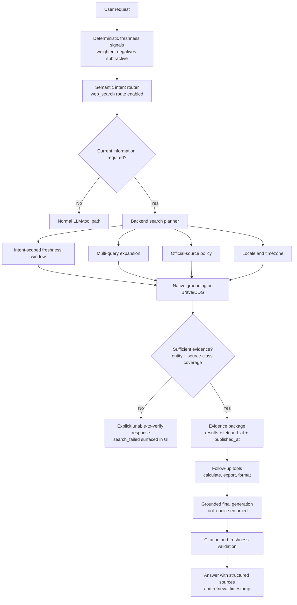

# Chat Studio current-information review

Reviewed against `main` at commit `8a18e91` on 2026-08-20. Every claim below cites the
file and line that supports it. Claims from the first draft that could not be confirmed
in code were corrected or removed.

> **Implementation status** — branch `fix/current-information-retrieval`.
> Line references in the findings point at the code **as reviewed** (commit `8a18e91`);
> they are historical evidence, not current line numbers. See
> [Implementation progress](#implementation-progress) for what has landed.

## Implementation progress

| Phase | Scope | Status |
|---|---|---|
| 0 | Stop the silent failure | ✅ Complete |
| 1 | Fix classification, then breadth | ✅ Complete |
| 2 | Make retrieval enforceable | ✅ Complete |
| 3 | Backend-owned preflight | ✅ Complete |
| 4 | Evidence contract and citations | ⏳ Not started |
| 5 | Provider strategy and measurement | ⏳ Not started |

### Phase 0 — complete

| # | Change | Result |
|---|---|---|
| 0.1 | Brave gzip defect | Manual `Accept-Encoding` header removed; new `readResponseBody` decodes a gzip `Content-Encoding` defensively, so the path works whether or not an intermediary compresses. |
| 0.2 | `brave_provider_test.go` | 8 tests: gzip, gzip-without-transport-help (`DisableCompression`, reproducing the original failure shape), plain JSON, malformed body, 429 truncation, request parameters, empty-`TimeRange`, cancellation. |
| 0.3 | `ddg_provider_test.go` | 8 tests over a recorded HTML fixture, including a markup-drift case that now fails CI instead of silently returning nothing. |
| 0.4 | Failure logging | `searchWithPlan` logs `ERROR: websearch provider %q failed …`. `Provider` gained `Name() string`, documented as never carrying credentials. |
| 0.5 | Visible degradation | New `searchStatus` type writes `search_attempted` / `search_failed` / `search_failure_reason` into message metadata and the SSE `done` payload on **both** handler paths. Frontend renders a `RetrievalStatus` banner. |
| 0.6 | DDG `30d` | Handled; empty `TimeRange` now deliberately adds no temporal terms. |

Beyond the planned scope, three defects surfaced while building the tests:

- **DDG treated markup drift as success.** A 200 response the parser could not read
  produced zero results and no error, which the orchestrator could not distinguish from
  "the web has nothing". It is now a provider error.
- **`onWebSearch` ignored `status: "failed"`.** The store set `webSearching: true` for
  every status, so a failed retrieval left the spinner running and recorded no failure
  state at all.
- **`data.sources || fallback` could not recover empty native results.** An empty array
  is truthy in JavaScript, so the fallback never ran. Now length-checked.

The soft fallback directive was also rewritten. The old text ("answer from your training
data and mention that the information may not be current") is what the reviewed model
response ignored. The replacement forbids specific stale claim types, and — more
importantly — the UI banner now derives from metadata rather than depending on the model
choosing to comply.

### Phase 1 — complete

| # | Change | Result |
|---|---|---|
| 1.1 | Gate rework | `negativePatterns` are now subtractive weights. New `decisivePatterns` short-circuit the score for explicit recency signals, and a narrow `hardSuppressPatterns` list (fenced code, "fix this", conceptual-in-programming) outranks them. `searchScore` no longer breaks early — that was incorrect once negatives could lower the total. |
| 1.2 | Test rewrite | `gate_test.go:50` inverted: "What's the latest version of React?" must now search. Added 10 technology current-information cases, 8 code-question cases that must stay suppressed, and a precedence test proving hard suppression beats a recency word. |
| 1.3 | Freshness by intent | New `pricing`, `benchmark`, and `release` intents carry **no** `TimeRange`. `inferTimeRange` now defaults to `""` instead of `24h`. Market data, news, weather, and scores keep their tight windows. |
| 1.4 | Query expansion | `queryVariants` builds bounded, de-duplicated query sets for pricing, benchmark, release, and research shapes. New `normalizePlan` clamps `MaxIterations` to `len(Queries)` so a plan can no longer advertise iterations that cannot run. |
| 1.5 | Sufficiency check | `ResultsLikelyAnswerable` is shape-aware: distinct-**host** count against `MinSources`, plus a required-source-class check against `PreferredDomains`. New `rankByPreferredDomains` promotes first-party pages before the summarizer sees them, renumbering citation indexes. |
| 1.6 | Locale | Wired to Brave `search_lang` / `ui_lang` (landed with Phase 0, since the provider test asserted it). |

Three further defects surfaced from the new table-driven test:

- **`"score"` swallowed benchmark queries.** `strings.Contains(lower, "score")` sits above the research branches, so "latest SWE-bench leaderboard **score**s" was planned as a 4-result sports brief. Benchmarks are now checked first, guarded by `sportsEventPattern` so "NFL power rankings" stays out.
- **`MaxIterations` was inconsistent, not just unreachable.** Single-query plans advertised `MaxIterations: 2`. `normalizePlan` now makes the struct self-describing.
- **The planner's research shape was unreachable.** `researchPattern` keys on "comprehensive", "investigate", "report on" — but the *gate* had no matching trigger, so "give me a comprehensive investigation of X" scored zero and never reached the planner. Added as a weight-2 trigger.

**Residual gap, deliberately not closed here:** purely semantic phrasing with no keyword hook. "How do the available models compare?" now reaches the threshold via weak comparison/availability signals, but the general case is regex-resistant and belongs to the semantic router in Phase 3. `TestShouldWebSearch_ComparisonReachesThreshold` marks the boundary.

**Also unchanged by choice:** "the current state of X" still does not trigger. It is as often rhetorical as temporal, and `TestShouldWebSearch_WeakOnly` asserts the existing behaviour. Widening `current` to a bare decisive signal would have broken that case for no clear gain.

### Phase 2 — complete

| # | Change | Result |
|---|---|---|
| 2.1 | `ToolChoice` | New `llm.ToolChoice` (`auto`/`none`/`required`/`specific`) translated per provider at serialization time by `applyToolChoice`. Sent on an **allowlist** (`openai`, `anthropic`, `openrouter`, `groq`, `together`, `mistral`, `gemini`); omitted elsewhere. |
| 2.2 | Loop enforcement | New `toolEnforcement` forces `tool_choice` on round 0 only, observes what the model actually called, re-prompts once while the answer is still empty, and records `tool_required` / `tool_enforced` / `tool_requirement_unfulfilled` in metadata. Frontend renders a `tool-skipped` banner. |
| 2.3 | Tool defaults | `web_search` now gets server-chosen `TimeRange`, `Region`, `Locale`, and `MaxResults` from turn context and the plan. |
| 2.4 | `PlannedSearch` | New orchestrator method; `WebSearchTool.Execute` uses it. `DirectSearch` is now documented as reserved for `/v1/websearch`. |
| 2.5 | Retrieval metadata | The tool payload changed from a bare result array to an object carrying `fetched_at`, `time_range`, `region`, `locale`, `intent`, `queries_run`, `evidence_sufficient`, and `guidance`. |
| 2.6 | `websearch_tool_test.go` | 9 tests asserting server-injected defaults, planner-derived freshness per intent, explicit-override handling, retrieval metadata, official-source ranking, insufficient-evidence hedging, and provider-failure propagation. |

Design notes worth recording, because each is a deliberate trade-off:

- **`tool_choice` is an allowlist, not a denylist.** A provider that rejects an
  unknown field returns 400 and breaks the entire turn — far worse than falling back
  to advisory behaviour. Ollama and generic OpenAI-compatible endpoints are excluded;
  the post-hoc check catches them instead.
- **Only round 0 is forced.** A provider held at `tool_choice: "required"` never emits
  a final answer, so the loop would run to its round limit every time.
- **The post-hoc check cannot retract an answer.** By the time the loop knows a required
  tool was skipped, tokens have already streamed. The re-prompt therefore fires only
  while `fullContent == ""`; otherwise the outcome is recorded in metadata and rendered
  as an "unverified" banner. Pretending the answer can be rejected after streaming would
  duplicate content in the UI.
- **`PlannedSearch` falls back to a general plan** when the conversational gate would
  not have fired. An explicit tool call *is* the intent signal, so refusing to search
  because the phrasing lacked a keyword would be wrong.

**Also found:** the non-streaming `Send` handler has **no tool loop at all**. `selectChatToolsForContext` is called only in the streaming path, so `llmReq.Tools` is never set for non-streaming requests. The review described this as an "asymmetry"; it is more accurate to say non-streaming chat has no tool support whatsoever. Phase 3.5 addresses it.

### Phase 3 — complete

| # | Change | Result |
|---|---|---|
| 3.1 | Router route | `RouteWebSearch` is now selectable. The router prompt describes it (including "a question about software can still be a question about the present state of the world"), and `ValidateDecision` accepts it under `tools_only` / `all_preflight` — modes that were declared but unreachable. |
| 3.2 | Two-stage classification | New `classifyCurrentInformation`: the deterministic gate runs first and is authoritative when it fires; the semantic router is consulted **only** when the gate declined, and only under the opt-in modes. Mirrors the existing sports precedent where a probabilistic decision cannot suppress a deterministic signal. |
| 3.3 | Preflight → tools | New `Orchestrator.Preflight` retrieves without generating. Compound turns get `EvidenceSystemMessage` injected, then enter the tool loop. Simple lookups keep the orchestrator path, which is cheaper — native grounding folds retrieval and generation into one call. |
| 3.4 | Bypass removed | `requiresComposableToolLoop` → `requiresPostRetrievalTools`. It no longer means "skip retrieval"; it selects *how* retrieval runs. Follow-up verbs widened with `compare`, `rank`, `summarize`, `chart`, `table`, `plot` — `compare` was the exact word the reviewed prompt used. |
| 3.5 | Non-streaming parity | New `runSyncToolLoop`, plus the same classify-and-preflight sequence. |
| 3.6 | Tests | 8 preflight tests (reusable evidence, skip-when-not-current, tool call survives failure, empty results are a failure, evidence-message content, insufficient-evidence hedging, nil safety, expanded query set actually issues multiple provider calls) and 6 handler tests covering the three compound prompts plus wiring assertions. |

**Non-streaming was worse than "asymmetric".** The review said `Process` terminates the turn so no follow-up tool can run. Verifying it turned up something stronger: `selectChatToolsForContext` was only ever called from the streaming handler, so `llmReq.Tools` was never set on the non-streaming path and `ChatComplete` could not produce a tool call at all. Non-streaming chat had **no tool support whatsoever**. `runSyncToolLoop` adds it, deliberately smaller than the streaming loop (no SSE progress, no browser-navigation budget, 6 rounds instead of 10) because a non-streaming caller is blocked on one response.

Two design decisions worth recording:

- **The semantic router is opt-in.** Consulting it on every turn the gate declined would add an LLM call to most conversations. It runs only under `tools_only` / `all_preflight`, so the default configuration pays nothing. The cost of that choice is that regex-resistant phrasing still misses by default — an honest limit, not a hidden one.
- **`Preflight` returns its `ToolCall` even on failure.** The handler keys its "attempted and failed" branch on a non-nil tool call, so returning nil there would have made preflight failures invisible — reintroducing the Phase 0 bug through a new path. `TestPreflightReturnsToolCallOnFailure` pins it.

**Testing limit, stated plainly:** this package has no HTTP harness for `MessageHandler` (it would need a live DB plus a mock LLM), so the compound-request tests assert the decision layer — planner wants retrieval **and** the turn is classified as needing follow-up tools — plus source-level wiring assertions in the style of the existing `message_handler_tool_runtime_wiring_test.go`. That verifies the composition, not a real end-to-end turn.

## Investigation summary

The original conversation exposed two problems:

1. The model response was dated and made unsupported benchmark/pricing claims.
2. Chat Studio's current-data retrieval path is not enforced consistently.

The first draft attributed the failure primarily to compound-request routing. That
diagnosis was too narrow and, for the specific prompt involved, wrong. Verification
against the code found a hard transport defect that silently disables the only
freshness-capable search provider, plus a keyword gate that actively *suppresses*
current-information search for a large class of technology questions. Both are more
likely to have produced the observed answer than the compound-request bypass.

The root cause is still an orchestration/control-flow problem, not a bad model. The
ranking of causes has changed.

## Corrections to the previous draft

| Previous claim | Status | Correction |
|---|---|---|
| The attached prompt was routed into the generic tool loop by `requiresComposableToolLoop()` | **Incorrect** | That function needs a follow-up-action keyword, and `compare` is not in the list ([chat_tool_runtime.go:280-283](../backend/internal/api/chat_tool_runtime.go#L280-L283)). "…and compare benchmark versus cost" does not match, so the prompt did reach `ProcessStream`. |
| `web_search` omitting `time_range` means "the local provider receives no freshness constraint" | **Partly incorrect** | True for the tool path only. The planner path has the opposite problem: `inferTimeRange` defaults to `24h` for everything ([gate.go:167-180](../backend/internal/websearch/gate.go#L167-L180)) and the research branch never widens it ([planner.go:101-106](../backend/internal/websearch/planner.go#L101-L106)), so research queries are clamped to a 24-hour window. |
| `DirectSearch()` skips "query expansion" and "multi-query retrieval" that the planner path has | **Misleading** | The planner path does not meaningfully have them either. See finding 3. |
| The gate "can miss" natural current-information questions | **Understated** | The gate *hard-suppresses* them via negative patterns, before scoring, and an existing test asserts this as intended behavior. See finding 2. |
| Sections were ordered by conceptual grouping | **Reordered** | Findings are now ranked by likelihood of causing the observed symptom. |

---

## Finding 1 — Brave Search is broken by a gzip transport defect (highest severity)

[brave_provider.go:101](../backend/internal/websearch/brave_provider.go#L101) sets the
request header manually:

```go
httpReq.Header.Set("Accept-Encoding", "gzip")
```

Go's `http.Transport` performs transparent gzip decompression **only when it added the
`Accept-Encoding` header itself**. Setting it explicitly transfers decoding
responsibility to the caller, and nothing in `brave_provider.go` decodes the body — the
raw bytes go straight to `io.ReadAll` and `json.Unmarshal`
([brave_provider.go:112-119](../backend/internal/websearch/brave_provider.go#L112-L119)).
`grep -rn gzip internal/websearch/` returns exactly one hit: line 101.

Verified empirically with an `httptest` server responding `Content-Encoding: gzip`:

```text
manual header -> Content-Encoding="gzip"  body-is-json=false  first-bytes=[31 139 8 0]
no header     -> Content-Encoding=""      body-is-json=true
```

`[31 139 8 0]` is the gzip magic number, so `json.Unmarshal` fails with
`decode brave response: invalid character '\x1f'`.

Consequences whenever Brave honors the requested encoding:

- `searchWithPlan` gets an error and returns no results
  ([orchestrator.go:226-231](../backend/internal/websearch/orchestrator.go#L226-L231));
- `ProcessStream` returns an error, and the handler falls into the normal LLM path with
  a soft note asking the model to "answer from your training data and mention that the
  information may not be current"
  ([message_handler.go:1025-1035](../backend/internal/api/message_handler.go#L1025-L1035));
- the user sees a confident, ungrounded answer with no visible failure;
- the `web_search` tool's `DirectSearch` call fails the same way
  ([websearch_tool.go:98](../backend/internal/tools/websearch_tool.go#L98)).

Every user who followed the documented advice to configure a Brave API key for freshness
support has been silently downgraded to model memory. There is **no
`brave_provider_test.go`** in the repository, which is why this survived.

**Fix:** remove the manual header and let the transport negotiate, or decode explicitly
with `gzip.NewReader` when the response declares `Content-Encoding: gzip`. Add a
provider test with a gzip-encoding `httptest` server.

---

## Finding 2 — The keyword gate hard-suppresses technology current-information questions

[gate.go:70-77](../backend/internal/websearch/gate.go#L70-L77) defines
`negativePatterns`, and [gate.go:86-91](../backend/internal/websearch/gate.go#L86-L91)
evaluates them **before** any scoring, returning immediately:

```go
for _, neg := range negativePatterns {
    if neg.MatchString(lower) {
        return false, nil
    }
}
```

The pattern list includes `code|coding|function|…|library|framework`,
`implement|refactor|optimize|…|test`, and
`html|css|javascript|typescript|python|golang|rust|java|sql|react|vue|angular|docker|kubernetes|git|npm|pip|cargo`.

There is no weight and no override. A single match kills retrieval regardless of how
many strong temporal signals are present. Concretely suppressed today:

- "What is the best LLM for Go **coding** right now?"
- "What are the latest benchmark results for **coding** models?"
- "What's the current **Kubernetes** release?"
- "Latest **React** version?"

The last one is asserted as *correct* behavior by the existing suite at
[gate_test.go:50](../backend/internal/websearch/gate_test.go#L50):

```go
{"react question", "What's the latest version of React?"},
```

That test encodes the defect as a requirement, which makes this a deliberate-design
question rather than a simple bug.

The intent behind negative patterns is sound — "explain recursion" should not search the
web. The implementation conflates *subject matter* with *temporal need*. A question can
be about software and still require current data.

**Fix:** make negative patterns subtractive weights rather than an early return, and
never let them override a strong temporal signal (`latest`, `today`, `current release`,
`newest version`). Keep the early return only for the explanatory pattern
(`explain`, `definition of`, `difference between … in programming`).

---

## Finding 3 — Bounded iterative retrieval is documented but not implemented

`docs/PROVIDER_AWARE_SEARCH.md` promises "up to 3 targeted iterations" for research and
"bounded iterative retrieval" for standard answers. Neither happens, for two independent
reasons:

1. **`plan.Queries` almost always has length 1.** `BuildSearchPlan` populates it from a
   single `toolCall.Arguments.Query`
   ([planner.go:64](../backend/internal/websearch/planner.go#L64)). Only the sports
   schedule branch calls `scheduleQueries` to produce two
   ([planner.go:80](../backend/internal/websearch/planner.go#L80)). The research branch
   raises `MaxIterations` to 3 but never adds queries
   ([planner.go:101-106](../backend/internal/websearch/planner.go#L101-L106)). Because
   `iterations` is clamped to `len(plan.Queries)`
   ([orchestrator.go:211-214](../backend/internal/websearch/orchestrator.go#L211-L214)),
   `MaxIterations` above 1 is dead for every non-schedule intent.
2. **The loop breaks after the first iteration anyway.** `ResultsLikelyAnswerable`
   returns `true` for any non-`Direct` answer shape as soon as one result exists
   ([answerability.go:40-46](../backend/internal/websearch/answerability.go#L40-L46)),
   and `searchWithPlan` breaks on that
   ([orchestrator.go:251-253](../backend/internal/websearch/orchestrator.go#L251-L253)).

So a research request performs exactly one search, of one unexpanded query, clamped to a
24-hour freshness window. For "compare LLM benchmarks and pricing" that is close to the
worst possible retrieval strategy: official pricing pages are rarely re-published within
24 hours, so the freshness filter removes precisely the primary sources needed.

**Fix:** have `BuildSearchPlan` emit real query sets for `Research` and `Standard`
shapes (provider-targeted, benchmark-targeted, official-source-targeted), widen or drop
`TimeRange` for research and comparison intents, and replace the
`ResultsLikelyAnswerable` short-circuit with a shape-aware sufficiency check — coverage
of required entities and source classes, not `len(results) > 0`.

---

## Finding 4 — "Required tool" mode has no provider-level or post-hoc enforcement

`grep -rn "ToolChoice\|tool_choice" internal/` returns **zero** hits. The LLM layer has
no way to express OpenAI/Anthropic/Gemini forced tool choice.

`turnToolModeRequired` therefore reduces to two things: a filter on which tool
definitions are advertised
([chat_turn_tools.go:60-74](../backend/internal/api/chat_turn_tools.go#L60-L74)) and a
system-prompt sentence
([chat_turn_tools.go:77-91](../backend/internal/api/chat_turn_tools.go#L77-L91)):

```text
TOOL MODE: You must call the %s tool before answering.
```

Nothing verifies afterwards that the tool was called — `grep -rn turnToolModeRequired`
shows no enforcement site in the tool loop. The mode is also only ever set from the
client request body
([message_handler.go:178](../backend/internal/api/message_handler.go#L178),
[message_handler.go:203](../backend/internal/api/message_handler.go#L203)); nothing
infers `required` from message content, so a current-information prompt never receives
it.

The previous draft said the directive is "only advisory for many providers." It is
advisory for *all* providers here, because the enforcement mechanism does not exist.

**Fix:** add `ToolChoice` to `llm.ChatRequest` with per-provider mapping, and add a
loop-exit check that refuses to accept a final answer when a required tool was never
invoked.

---

## Finding 5 — Compound current-data requests bypass the orchestrator (streaming only)

[message_handler.go:944](../backend/internal/api/message_handler.go#L944):

```go
if webSearchEnabled && !requiresComposableToolLoop(req.Content) {
    searchResp, wsLLMReq, toolCall, wsErr = h.orchestrator.ProcessStream(...)
}
```

`requiresComposableToolLoop` requires a current-information term **and** a follow-up
action term
([chat_tool_runtime.go:278-284](../backend/internal/api/chat_tool_runtime.go#L278-L284)).
Matching is lowercase substring, so the trigger set is narrow and slightly leaky.

Prompts that do bypass the orchestrator:

- "Find the latest prices and **calculate** the total"
- "Search current news and **export** the summary"
- "Research the latest models and **generate** a table"

Prompts that do **not**, contrary to the previous draft:

- "Research the best LLM available via API and **compare** benchmark versus cost" —
  `compare` is not a follow-up action.

On the bypass path, `web_search` is advertised in the tool catalog
([chat_tool_runtime.go:81-83](../backend/internal/api/chat_tool_runtime.go#L81-L83)),
but calling it is entirely the model's choice, and per finding 4 there is no way to
require it.

**Nuance the previous draft missed:** this bypass is a deliberate trade-off, not an
oversight. The non-streaming path has no such bypass — it always calls `Process`
([message_handler.go:414-421](../backend/internal/api/message_handler.go#L414-L421)) —
and when the orchestrator handles the turn it *terminates the turn* and returns
([message_handler.go:463-465](../backend/internal/api/message_handler.go#L463-L465)), so
no follow-up tool can ever run. Non-streaming compound requests get search with no
calculation; streaming compound requests get calculation with optional search. Neither
composes. The fix is a preflight-then-tools sequence, not simply deleting the bypass.

---

## Finding 6 — The `web_search` tool is strictly weaker than the REST endpoint

[websearch_tool.go:92-98](../backend/internal/tools/websearch_tool.go#L92-L98) builds a
`SearchRequest` with `Query`, `TimeRange` (optional, no default), and `MaxResults`
(default 5). `Region` and `Locale` are left empty, and the call goes to `DirectSearch`,
which bypasses the planner entirely
([orchestrator.go:194-200](../backend/internal/websearch/orchestrator.go#L194-L200)).

The REST handler covering the same orchestrator method *does* apply defaults — `24h`,
`US`, `en-US`, `10`
([websearch_handler.go:41-52](../backend/internal/api/websearch_handler.go#L41-L52)).
The model-facing path is the one missing them.

Consequences for the tool path:

- empty `Region` means Brave omits `country` and DDG omits `kl`;
- empty `TimeRange` means Brave omits `freshness` and DDG appends no temporal terms
  ([brave_provider.go:76-84](../backend/internal/websearch/brave_provider.go#L76-L84),
  [ddg_provider.go:42-55](../backend/internal/websearch/ddg_provider.go#L42-L55));
- `resp.FetchedAt` is available but never surfaced in the tool metadata
  ([websearch_tool.go:106-110](../backend/internal/tools/websearch_tool.go#L106-L110)),
  so the model receives no retrieval timestamp.

There is no `websearch_tool_test.go`.

---

## Finding 7 — `SearchRequest.Locale` is a dead field

The orchestrator populates `Locale` from turn context
([orchestrator.go:223](../backend/internal/websearch/orchestrator.go#L223)), but neither
provider reads it. Brave maps only `Region → country`
([brave_provider.go:86-89](../backend/internal/websearch/brave_provider.go#L86-L89)) and
DDG maps only `Region → kl`
([ddg_provider.go:57-61](../backend/internal/websearch/ddg_provider.go#L57-L61)).
`grep -rn "search_lang\|ui_lang" internal/` returns nothing.

This matters for any recommendation to "propagate locale": the plumbing already exists
and terminates in a no-op. Brave supports `search_lang` and `ui_lang`; wiring `Locale`
to them is a small, self-contained change.

---

## Finding 8 — Streaming accepts native-grounded output without validating grounding

`Process` validates with `ValidateAnswer` on both the native and local branches
([orchestrator.go:70](../backend/internal/websearch/orchestrator.go#L70),
[orchestrator.go:103](../backend/internal/websearch/orchestrator.go#L103)).

`ProcessStream` only builds and returns a request
([orchestrator.go:144-151](../backend/internal/websearch/orchestrator.go#L144-L151)),
and the handler streams it with no post-stream check
([message_handler.go:979-1000](../backend/internal/api/message_handler.go#L979-L1000)).
There is no streaming equivalent of verifying that grounding annotations exist, that
citations are present, or that source dates meet the requested freshness.

Compounding this, the native branch returns a `SearchResponse` with **no `Results`**:

```go
return &SearchResponse{
    Query:     toolCall.Arguments.Query,
    TimeRange: plan.TimeRange,
    FetchedAt: time.Now().UTC(),
}, &req, toolCall, nil
```

The handler then sends `web_search_results` with an empty array
([message_handler.go:958-962](../backend/internal/api/message_handler.go#L958-L962)) and
persists `metadata["sources"] = searchResp.Results` — empty
([message_handler.go:1383](../backend/internal/api/message_handler.go#L1383)). The
frontend reads `metadata?.sources ?? []`
([ChatView.tsx:1565](../frontend/src/components/ChatView.tsx#L1565)), and the store's
`data.sources || get().webSearchResults`
([stores/index.ts:381](../frontend/src/stores/index.ts#L381)) does not recover it,
because an empty array is truthy in JavaScript.

Native citations instead end up as **markdown text appended to message content** by
`appendCitations`
([native_search.go:584-611](../backend/internal/llm/native_search.go#L584-L611)), which
produces a `**Sources:**` block inside the answer. Two consequences: the backend cannot
count or validate citations, and the source panel is empty for every natively-grounded
answer.

---

## Finding 9 — Answer validation is structural, not factual

[answerability.go:9-37](../backend/internal/websearch/answerability.go#L9-L37).
`ValidateAnswer` returns `true` for any non-empty content unless the answer shape is
`Direct`:

```go
if plan.AnswerShape != AnswerShapeDirect {
    return true, ""
}
```

Since only the sports schedule branch sets `AnswerShapeDirect`
([planner.go:73-83](../backend/internal/websearch/planner.go#L73-L83)), validation is
effectively sports-only. Every `Brief`, `Standard`, and `Research` answer is accepted on
the sole condition that it is non-empty.

Nothing verifies that claims are supported by retrieved results, that numeric values
match source content, that sources fall inside the requested window, or that citations
exist. For an answer containing precise-looking benchmark percentages, prices, and
rankings, those should be treated as claims requiring evidence.

---

## Finding 10 — Local search quality is weakest on the default provider

`NewProviderFromSettings` falls back to DuckDuckGo whenever no Brave key is present,
including the "brave selected but no API key" case
([factory.go:22-56](../backend/internal/websearch/factory.go#L22-L56)). With finding 1
unresolved, DDG is effectively the *only* working provider.

`DuckDuckGoProvider` approximates freshness by appending terms to the query
([ddg_provider.go:42-55](../backend/internal/websearch/ddg_provider.go#L42-L55)) and
always sets `PublishedAt: ""`
([ddg_provider.go:100](../backend/internal/websearch/ddg_provider.go#L100)). Two extra
details:

- the `30d` range is not handled in the switch at all, so it adds no temporal term;
- it scrapes `html.duckduckgo.com` and depends on the
  `result__body`/`result__a`/`result__snippet` class names
  ([ddg_provider.go:110-165](../backend/internal/websearch/ddg_provider.go#L110-L165)),
  so a DDG markup change silently yields zero results. There is no
  `ddg_provider_test.go`.

Brave does support real freshness parameters, but `PublishedAt` is stored as Brave's
free-form age string (`"2 hours ago"`) with no parsing
([brave_provider.go:147](../backend/internal/websearch/brave_provider.go#L147),
[brave_provider.go:161-165](../backend/internal/websearch/brave_provider.go#L161-L165)),
so the application cannot enforce a freshness window even when it has the data.

---

## Finding 11 — Native-capability detection is uneven in both directions

[planner.go:157-171](../backend/internal/websearch/planner.go#L157-L171).

Too optimistic:

- `case "openrouter": return true` — every model behind an OpenRouter profile is assumed
  to support `openrouter:web_search`, including ones that do not.
- OpenAI and Gemini are matched on name prefixes, so any custom or fine-tuned model
  whose name starts with `gpt-5` or `gemini-3` is assumed capable.

Too pessimistic, and unmentioned in the previous draft:

- `default: return false` covers `anthropic`, which is a first-class provider type
  ([service.go:344](../backend/internal/llm/service.go#L344)) and does offer a native
  server-side web-search tool. Every Claude model in Chat Studio is forced onto the
  Brave/DDG fallback that finding 1 shows is broken. `planner_test.go` asserts this as
  intended (`{"anthropic", "claude-opus-4-7", false}`).

Adding Anthropic native grounding is likely the largest quality win available after
finding 1, given how many users run Claude models.

---

## Finding 12 — The router has a `web_search` route that is never requested

`RouteWebSearch` exists in the route enum
([router/types.go:12](../backend/internal/router/types.go#L12)) and in the structured
output schema ([router/schema.go:37](../backend/internal/router/schema.go#L37)).

The only call site restricts the candidate set to sports:

```go
Mode:            intentrouter.RouterModeSportsOnly,
AvailableRoutes: []intentrouter.RouteName{RouteSportsLookup, RouteNormalLLM, RouteClarify},
```

([message_handler.go:2288-2296](../backend/internal/api/message_handler.go#L2288-L2296)).

`RouterModeToolsOnly` and `RouterModeAllPreflight` are declared
([router/types.go:25-26](../backend/internal/router/types.go#L25-L26)) and referenced
nowhere outside that file. The semantic-routing infrastructure the fix needs is already
built; it is simply not wired to current-information turns.

---

## Why the original answer was especially vulnerable

The request needed current model availability, current API pricing, current benchmark
results, cross-provider comparison, and citations. Given the verified findings, the most
likely execution was:

1. The gate scored the prompt above threshold (`best … for` + `vs`/`compared to` +
   `pricing`), so `plan.NeedsWeb` was true and `AnswerShapeStandard` was assigned.
   `researchPattern` requires a literal `deep research`, `comprehensive`,
   `detailed analysis`, `compare all`, `investigate`, or `report on`
   ([planner.go:49](../backend/internal/websearch/planner.go#L49)), none of which
   appeared.
2. One search ran, with one unexpanded query, clamped to `24h` (findings 3 and 1).
3. If Brave was configured, that search failed outright (finding 1). If DDG was used, it
   returned undated snippets with `latest today` bolted onto the query (finding 10).
4. On failure the handler injected "answer from your training data and mention that the
   information may not be current" and streamed a normal completion
   ([message_handler.go:1025-1035](../backend/internal/api/message_handler.go#L1025-L1035)).
5. Nothing validated the result, because `ValidateAnswer` waves through every
   non-`Direct` shape (finding 9).
6. No sources appeared in the source panel (finding 8).

The answer's internal signals match: dated model names and pricing, unsupported
benchmark approximations, no per-row citations, no retrieval timestamp, and confident
recommendations.

Note that the soft-fallback note *did* fire — the system asked the model to say the
information may not be current, and the model did not comply. That is the general
lesson: prompt-level mitigations are not enforcement.

---

## Root-cause statement

> Chat Studio treats current-information retrieval as best-effort at every layer. The
> only freshness-capable search provider fails on a gzip transport defect and degrades
> silently to model memory. The keyword gate suppresses retrieval outright for
> technology questions, including the ones most likely to need it. When retrieval does
> run, it is a single unexpanded query clamped to a 24-hour window regardless of intent.
> Nothing afterwards verifies that evidence was retrieved, that it is recent, or that
> the answer's numeric claims are supported — `ValidateAnswer` accepts any non-empty
> string outside the sports schedule path. The result is confident, well-formatted
> answers from stale model knowledge, with an empty source panel, for exactly the class
> of changing data users are most likely to ask about.

---

## Phased resolution plan

Phases are ordered by verified impact per unit of work. Each phase is independently
shippable and leaves the system better than before. Every phase must land with the
required CI gate green (`.github/workflows/ci.yml`, per `CLAUDE.md`).

### Phase 0 — Stop the silent failure

The system currently misrepresents whether retrieval happened. Fix that before anything
architectural.

| # | Change | Files |
|---|---|---|
| 0.1 | Remove the manual `Accept-Encoding: gzip` header, or decode with `gzip.NewReader` when the response declares it | `internal/websearch/brave_provider.go:101` |
| 0.2 | Add `brave_provider_test.go`: gzip-encoding `httptest` server, plain server, malformed body, non-200 status | new file |
| 0.3 | Add `ddg_provider_test.go` with a recorded DDG HTML fixture so markup drift fails CI instead of returning zero results | new file |
| 0.4 | Log local-search provider failures at `ERROR` with the provider name and a redacted reason; never log the API key | `orchestrator.go:226-231` |
| 0.5 | Replace the silent soft-fallback with an explicit user-visible state: keep the `web_search` status `failed` event and also set `metadata["search_failed"] = true` so the frontend renders "could not verify current information" instead of an ordinary answer | `message_handler.go:1025-1035`, `stores/index.ts`, `ChatView.tsx` |
| 0.6 | Handle `30d` in the DDG freshness switch | `ddg_provider.go:42-55` |

**Exit criteria:** a configured Brave key produces parsed results in a unit test; a
forced provider failure produces a visibly degraded answer in the UI, not a confident
one. Backend unit + race and frontend lint/unit/build green.

**Why first:** 0.1 is a one-line fix that restores the entire freshness-capable path.
Every later phase is measured against a working provider, so shipping it first avoids
building on a broken baseline.

### Phase 1 — Fix classification, then fix breadth

Retrieval that never triggers cannot be improved by better retrieval.

| # | Change | Files |
|---|---|---|
| 1.1 | Convert `negativePatterns` from an early return to subtractive weights; keep an early return only for the explanatory pattern. A strong temporal signal must always survive | `gate.go:70-91` |
| 1.2 | Update `gate_test.go:50` — "What's the latest version of React?" must now trigger. Add cases for "best LLM for Go coding right now", "current Kubernetes release", "latest benchmark results for coding models" | `gate_test.go` |
| 1.3 | Add a `research`/`comparison` intent that does not inherit the `24h` default; widen or drop `TimeRange` for pricing, benchmark, and availability questions | `planner.go:101-106`, `gate.go:167-180` |
| 1.4 | Emit real multi-query sets for `Standard` and `Research` shapes (entity-targeted, official-source-targeted, benchmark-targeted) so `MaxIterations` stops being dead | `planner.go:53-108` |
| 1.5 | Replace the `ResultsLikelyAnswerable` short-circuit with a shape-aware sufficiency check: required-entity and source-class coverage, not `len(results) > 0` | `answerability.go:40-53`, `orchestrator.go:251-253` |
| 1.6 | Wire `SearchRequest.Locale` to Brave `search_lang`/`ui_lang`, or delete the field | `brave_provider.go:86-89`, `types.go:16` |

**Exit criteria:** a table-driven test asserts that roughly twenty representative
current-information prompts — technology, pricing, news, sports, general — produce the
expected `(NeedsWeb, Intent, AnswerShape, TimeRange, len(Queries))` tuple. Research
prompts must produce more than one query and must not be clamped to `24h`.

**Ordering note:** 1.3–1.5 are worthless without 1.1, because suppressed prompts never
reach the planner. Do not reorder.

### Phase 2 — Make retrieval enforceable rather than advisory

First phase requiring changes outside `internal/websearch`.

| # | Change | Files |
|---|---|---|
| 2.1 | Add `ToolChoice` to `llm.ChatRequest` with per-provider mapping (OpenAI `tool_choice`, Anthropic `tool_choice`, Gemini `function_calling_config`) and a documented no-op for providers that lack it | `internal/llm/service.go`, `internal/llm/types.go` |
| 2.2 | Enforce `turnToolModeRequired` after the loop: if the required tool was never invoked, do not accept the answer — re-prompt once, then degrade explicitly | `chat_tool_round.go`, `chat_turn_tools.go` |
| 2.3 | Give `WebSearchTool` server-side defaults matching the REST handler (`TimeRange`, `Region`, `Locale`, `MaxResults`) sourced from `turncontext`, so the model's omissions are repaired rather than honored | `websearch_tool.go:88-98` |
| 2.4 | Add a planner-backed orchestrator method — `PlannedSearch(ctx, query)` — and point `WebSearchTool.Execute` at it. Keep `DirectSearch` for `/v1/websearch` only | `orchestrator.go:194-200`, `websearch_tool.go:98` |
| 2.5 | Return `fetched_at`, `time_range`, and per-result `published_at` in the tool's metadata and content | `websearch_tool.go:100-115` |
| 2.6 | Add `websearch_tool_test.go` covering default injection, planner delegation, and metadata shape | new file |

**Exit criteria:** `web_search` called with only `{"query": "..."}` produces a request
carrying a server-chosen freshness window, region, and locale. A `required`-mode turn
where the model refuses to call the tool ends in an explicit degradation, not a normal
answer.

### Phase 3 — Backend-owned preflight for compound requests

Only safe now, because the retrieval it routes to actually works.

| # | Change | Files |
|---|---|---|
| 3.1 | Extend the router call to offer `RouteWebSearch` on non-sports turns, using the already-declared `RouterModeToolsOnly`/`RouterModeAllPreflight` modes | `message_handler.go:2288-2296`, `router/prompts.go`, `router/types.go:25-26` |
| 3.2 | Keep the deterministic gate as a cheap first pass; the semantic router handles what regex misses. A probabilistic `normal_llm` decision must not suppress a strong deterministic signal — mirror the existing sports precedent | `message_handler.go:2288-2340` |
| 3.3 | Replace `current request → generic tool loop` with `current request → retrieval preflight → tool loop → final answer`: run the preflight, inject its evidence as a system message, then enter the tool loop with the remaining tools | `message_handler.go:934-1035` |
| 3.4 | Delete the `requiresComposableToolLoop` bypass once 3.3 lands, since the preflight no longer terminates the turn | `message_handler.go:944`, `chat_tool_runtime.go:278-284` |
| 3.5 | Fix the non-streaming asymmetry: `Process` must be able to return evidence for a subsequent tool loop instead of ending the turn | `message_handler.go:414-466`, `orchestrator.go:47-124` |
| 3.6 | Add `message_handler` tests for "search + calculate", "search + export", and "research + compare" asserting that retrieval ran *and* the follow-up tool ran | `message_handler_test.go` |

**Exit criteria:** compound current-data prompts emit both a `web_search_results` SSE
event and a tool-call step in the same turn, in streaming and non-streaming modes alike.

**Scope warning:** 3.3 and 3.5 touch the largest function in `message_handler.go` and
must preserve cancellation and terminal `error`/`done` events per `CLAUDE.md`. Land
3.1–3.2 as a separate PR from 3.3–3.5.

### Phase 4 — Evidence contract and citation validation

| # | Change | Files |
|---|---|---|
| 4.1 | Populate `SearchResponse.Results` on the native streaming path from grounding annotations so `metadata.sources` is non-empty for natively-grounded answers | `orchestrator.go:144-151`, `native_search.go:387-406`, `native_search.go:524-525` |
| 4.2 | Surface native citations as structured data alongside — not instead of — the markdown block, so the backend can count them and the source panel can render them | `native_search.go:584-611`, `message_handler.go:1383` |
| 4.3 | Parse Brave's age string into a real timestamp and enforce the plan's freshness window at the application layer | `brave_provider.go:147`, `brave_provider.go:161-165` |
| 4.4 | Extend `ValidateAnswer` beyond `Direct`: flag answers that contain numeric claims with no citation, and answers whose evidence falls entirely outside the requested window | `answerability.go:9-37` |
| 4.5 | Add a post-stream validation hook so streaming answers get the same treatment as `Process` | `message_handler.go:979-1000` |
| 4.6 | Distinguish four frontend states: retrieval attempted, retrieval succeeded, sources available, freshness verified | `ChatView.tsx:1565`, `stores/index.ts:381` |

**Exit criteria:** a natively-grounded answer renders source chips, and an answer with
numeric claims and zero citations is flagged, with a test proving it.

**Honest caveat:** 4.4 is the least certain item in this plan. "Claims are supported by
sources" is not decidable by string matching, and an over-eager validator that rejects
correct answers is worse than today's permissive one. Ship it first as a *warning
signal* attached to metadata, measure the false-positive rate against the Phase 5 eval
set, and only promote it to a hard rejection once that rate is known. Do not ship 4.4 as
a blocking validator in the same PR that introduces it.

### Phase 5 — Provider strategy and measurement

| # | Change | Files |
|---|---|---|
| 5.1 | Add Anthropic native web search to `SupportsNativeSearch` plus an adapter, and update the `planner_test.go` expectation | `planner.go:157-171`, `native_search.go`, `planner_test.go` |
| 5.2 | Narrow the OpenRouter `return true` to routes actually known to support `openrouter:web_search`; treat a successful HTTP response as necessary but not sufficient evidence of grounding | `planner.go:159-160` |
| 5.3 | Add official-source prioritization for pricing and benchmark intents (provider docs domains, benchmark repositories) via `plan.AllowedDomains`, which the native path already forwards | `planner.go:53-108` |
| 5.4 | Fetch source pages for verification on research intents instead of relying on snippets; `JinaReader` already supports this at `enrichCount = 5` | `orchestrator.go:243-249` |
| 5.5 | Require two independent sources before a comparative numeric claim is presented as verified | `answerability.go` |
| 5.6 | Add an evaluation suite of known current-information questions with expected freshness and source classes. Track search-trigger recall, false-negative rate, source freshness, citation coverage, and cost per verified answer | new `internal/eval` cases |
| 5.7 | Correct `docs/PROVIDER_AWARE_SEARCH.md` so its capability matrix and iteration claims match the implementation | `docs/PROVIDER_AWARE_SEARCH.md` |

**Exit criteria:** the eval suite runs in CI against recorded fixtures and reports
trigger recall and citation coverage as tracked numbers.

### Documentation debt to clear alongside

`docs/PROVIDER_AWARE_SEARCH.md` currently overstates the implementation in two places,
each to be corrected in the phase that fixes the underlying behavior:

- "up to 3 targeted iterations" and "bounded iterative retrieval" are not implemented
  (finding 3) — corrected by Phase 1.4–1.5.
- "Anthropic direct — None in this implementation" is accurate but reads as a design
  decision rather than the capability gap it is (finding 11) — corrected by Phase 5.1.

---

## Target architecture



The highest-value structural change remains making the backend own the retrieval
decision and the evidence contract. But the most urgent change is smaller: make
retrieval actually work, and make its failures visible. The model should synthesize
verified evidence — not decide whether current information is needed, and not be trusted
to report that retrieval failed.
